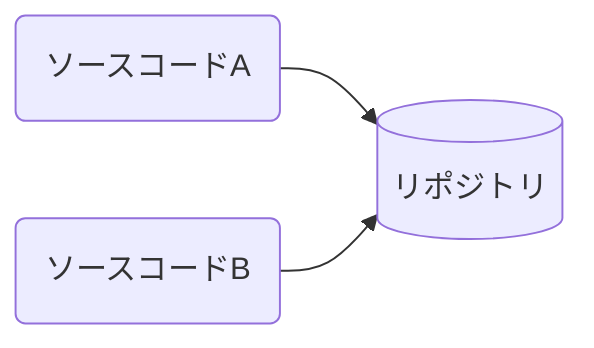
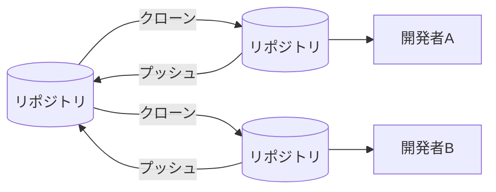
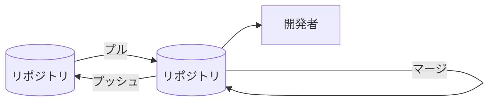

# Git

## gitとは？

gitは「バージョン管理システム」と呼ばれる類のツールです。gitを利用することでソースコードの変更を管理したり、他の開発者と変更内容を共有することが可能になります。

 * Wikipediaによる[Gitの説明](https://ja.wikipedia.org/wiki/Git)

## バージョン管理システム

アプリの作成においては、バグの修正や新しい機能を追加するためにソースコードを頻繁に修正・変更します。そうしているとアプリがビルドできなくなったり動作がおかしくなってしまう(バグが入り込んでしまう)ことがあります。

バージョン管理システムを利用することで、ソースコードが壊れてしまった場合に正しく動いていた状態まで戻したり、新しい機能を追加するために、現行のバージョンと一時的な開発バージョンを分けた形で開発を進めることも可能になります。

### 補足：git以外のバージョン管理システム

バージョン管理システムはgitだけでなく、[rcs](https://ja.wikipedia.org/wiki/Revision_Control_System)(Revision Control System)、[cvs](https://ja.wikipedia.org/wiki/Concurrent_Versions_System)(Concurrent Versions System)や[Subversion](https://ja.wikipedia.org/wiki/Apache_Subversion)、[Azure DevOps Server](https://ja.wikipedia.org/wiki/Azure_DevOps_Server)などがあります。

歴史的な経緯から見ると、当初は単一ファイルのソースコードについて変更管理していたものから、複数人での開発を可能にするため「リポジトリ」によるソースコードの集中管理(ただし変更をマージする場合は一度に一人だけが作業可能)を経て、リポジトリを分散させ、各人が任意のタイミングでリポジトリへの書き込みが可能になった、等々の機能が拡充された流れになっています。

gitはこのバージョン管理システムにおいて比較的新しい部類であり、現代的な開発作業にマッチする機能がサポートされています。
(ただ、これは見ようによっては機能が複雑で学習コストが少々かかるという意味合いにもなります)

### 補足：gitとGitHub

"git"の名前がついたものに[GitHub](https://github.com/)があります。これらは名前が似ていますが全くの別物となっています。gitは「バージョン管理システム」に分類されるツール(コマンド群)ですが、GitHubは「gitのリポジトリをホスティング(あずけて置ける)するプラットフォーム」となります。

このような違いから、GitHubにはgitには存在しない「プルリクエスト」のような機能が存在しています。

## バージョン管理システムを利用する際に必要となる概念

現代的なバージョン管理システムは「分散したリポジトリを各開発者がコピーして作業する」という概念を含める形で実装されており、git以外のバージョン管理システムにおいても、以下の概念はほぼ共通しています。

 * リポジトリ
 * クローン(チェックアウト)
 * 差分
 * コミット
 * ブランチ
 * プッシュ/プル
 * マージ

### リポジトリ

リポジトリは「ソースコードの変更を管理する入れ物」になります。例えば、家計簿アプリやToDoアプリといった各アプリケーションのソースコードををバージョン管理システムで扱う場合は、「家計簿アプリのリポジトリ」と「ToDoアプリのリポジトリ」のようにリポジトリ単位で変更を管理する形になります。

さらにこのリポジトリは一か所だけでなく、複数個所に分散して置いておくことも可能です。この場合、複数個所のリポジトリで異なる修正内容が管理される形になりますが、リポジトリ間での同期処理が可能であり、任意のタイミングでリポジトリの内容を一致させることができます。



### クローン(チェックアウト)

クローンは「任意のリポジトリを自分の作業環境にコピーしてくる処理」になります。リポジトリは同じものを分散させておくことが可能で、各開発者は既存のリポジトリの内容を自分の環境にクローンしておき、そのリポジトリに対して変更を反映してゆく形になります。

ある程度修正がまとまったら、クローン元のリポジトリに変更を反映させる(後述しますがこれは「プッシュ」と呼ばれる作業です)ことも可能です。


    
### 差分

ソースコードに変更を加えることで、リポジトリで管理されている内容と違いが発生します。これは「差分」と呼ばれ、開発者自身が修正箇所や修正内容を確認したり、他の開発者が修正内容をレビューする際に用いられます。

一般的に、バージョン管理システムはこの差分をリポジトリに記録しておくことで、いつどんな変更がソースコードに加えられたかを管理しています。

### コミット

コミットは「差分」の内容をリポジトリに記録する作業になります。この時に「この差分はどのような修正であるか」と記載したコミットメッセージを付与することができます。

コミットを行うタイミングには特に決まりはありませんが、差分の内容がリポジトリで記録・管理されることから、追加した機能毎やバグの修正毎にコミットすることで後から修正内容を確認したり思い出しやすくなります。


### ブランチ

リポジトリは差分単位での変更内容を記録・管理しますが、一連の差分は「ブランチ」というまとまりで扱われます。
(デフォルトでは"main"または"master"ブランチで管理されます)

例えば、アプリに大きな機能追加を行うと、差分だけでもかなりの量となり、それに伴いコミットも複数回発生します。このような場合はデフォルトのブランチから別途「new_featureブランチ」のように分岐させた状態で開発を進めることで、元のブランチには修正に伴うバグの発生といった影響が出なくなります。一通りの機能追加・動作確認とテストが完了した際には、デフォルトブランチにマージします。

### プッシュ/プル

プッシュ/プルは別リポジトリに対して自分のリポジトリ内の修正内容を送り出したり、逆に別リポジトリからブランチを取り込んだりする作業です。


### マージ

マージは別ブランチの内容を取り込む作業です。例えば機能追加用にnew_featureブランチで作業していたものをデフォルトのブランチに取り込む、といった場合に使用します。

ただし、マージにおいては「衝突」という、ソースコードの同じ行の修正内容に矛盾が発生する状態に陥ることがあり、この場合は人間が手動で衝突を修正してからマージすることになります。



## gitを使う

gitはバージョン管理システムを扱うためのコマンド群であり、基本的にはコマンドラインから"git"コマンドを使って操作します。ただ、現在のIDE(Integrated Development Environment;統合開発環境)においてはgitクライアントとしての機能が組み込まれているものもあり、直接gitコマンド触らなくても作業できる場合があります。

例えば、[Visual Studio Code](https://ja.wikipedia.org/wiki/Visual_Studio_Code)にはgitクライアントの機能が含まれており、(別途gitをインストールする必要はありますが)エディタからgitの機能を利用できます。Xcodeでgitを使う場合は[こちら](../xcode/xcode.md)を参照ください。

## gitのインストール

### エディタのインストール

gitの利用に必須ではありませんが、エディタからgitを扱うことを想定し、Visual Studio Code(VSCode)をあらかじめインストールしておきます。

 * [Visual Studio Code](https://code.visualstudio.com/)

VSCodeはgitクライアントの機能を内蔵していますが、内部的にgitコマンドを使用するため、別途gitのインストールが必要となる点に注意してください。

### Windowsの場合

Windowsの場合は、以下のURLからgitをインストールしてください。

 * https://git-scm.com/download/win

### macOSの場合

macOSの場合はデフォルトでgitコマンドがインストールされているかと思います(要確認)。

gitがインストールされているかどうかは、ターミナルから以下のコマンドを実行することで確認できます。 `which git` コマンドがgitコマンドのパスを返せばgitがインストールされています。

```sh
$ which git
/usr/bin/git
```

## gitを使用するための初期設定

gitでコミットを行う際、コミットを行った人の名前とメールアドレスが差分ととともに記録されます。そのため、あらかじめ名前とメールアドレスを設定しておかないとコミット時にエラーとなります。

コミットを行う人の名前とメールアドレスの設定は以下のコマンドで行います(Windows/macOS共に設定コマンドは共通です)。

Windowsの場合は「スタートボタン」-「Git」-「Git Bash」で起動したシェルで実行し、macOSの場合はターミナルから実行してください。

```sh
$ git config --global user.email "furandon.pig@gmail.com"
$ git config --global user.name "furandon-pig"
```

設定が完了すると、 `~/.gitconfig` に設定が書き込まれます。

```sh
$ cat ~/.gitconfig
[user]
        email = furandon.pig@gmail.com
        name = furandon-pig
```
