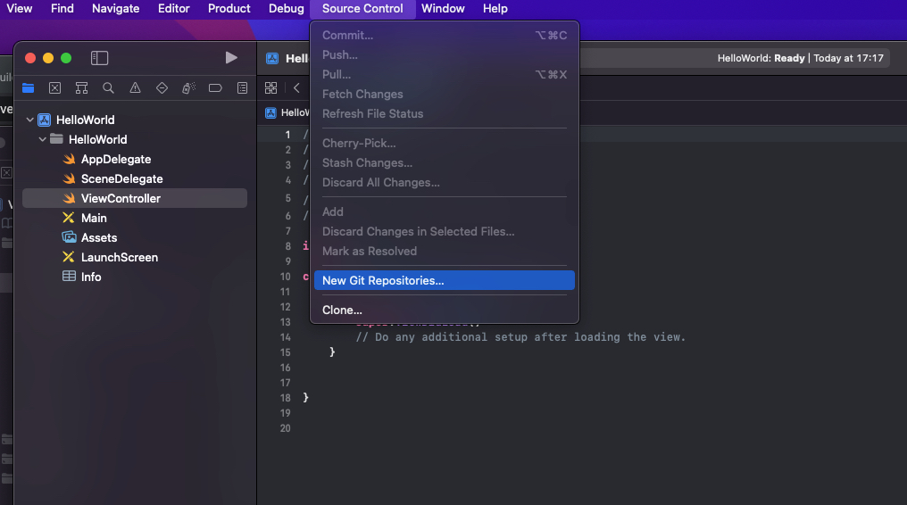
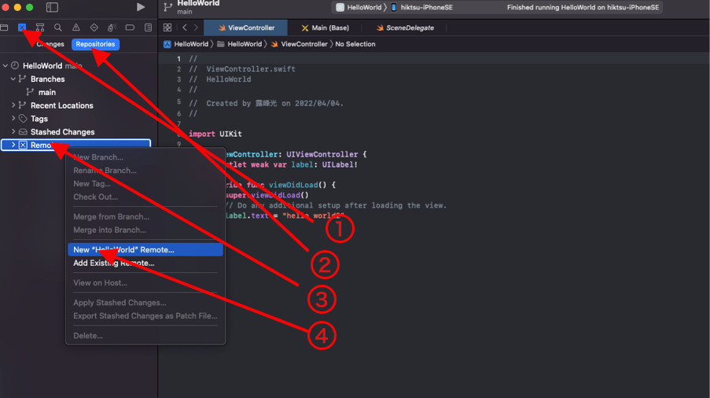
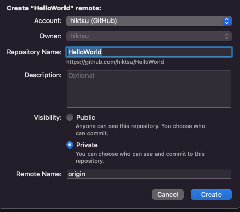
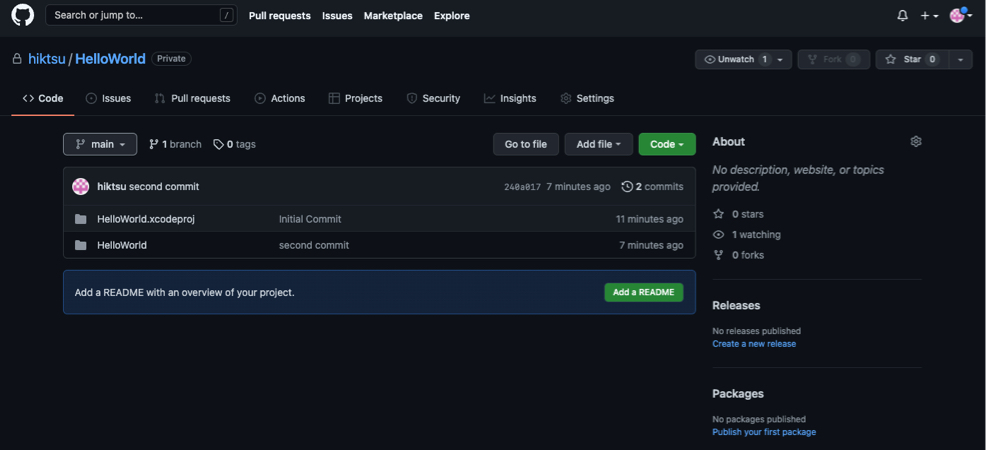
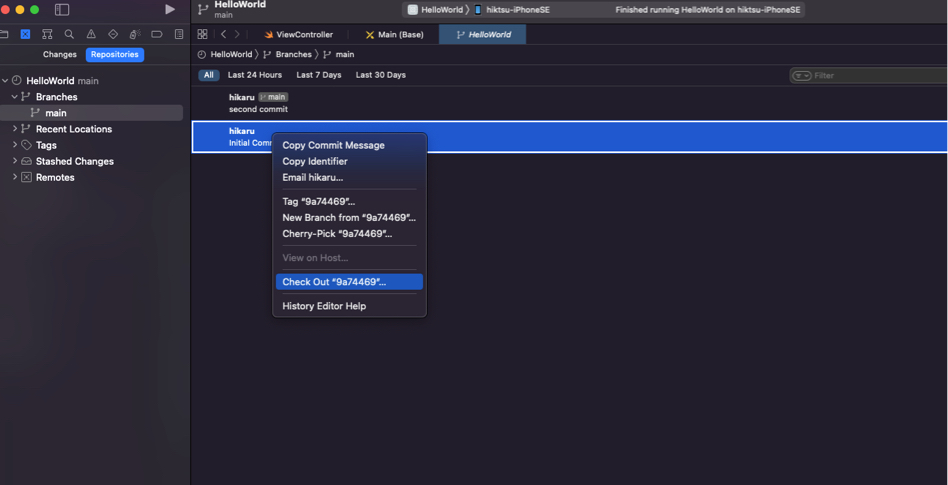
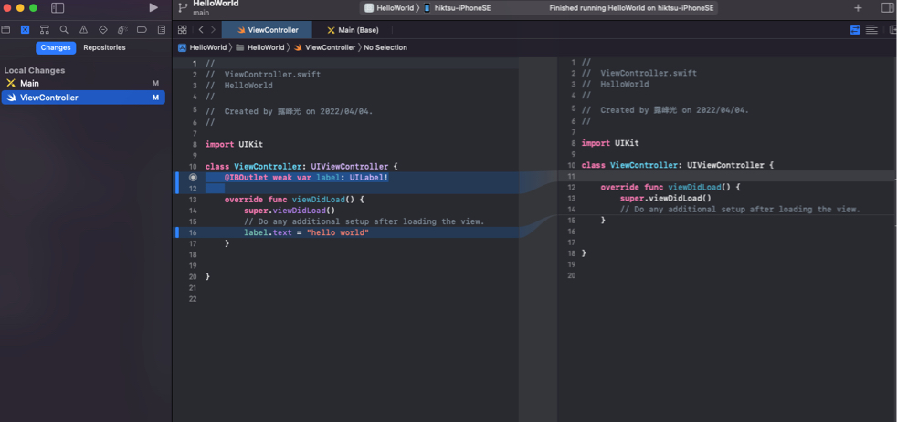

# XcodeからGit,GitHubを使う

## 事前の準備

 * GitHubにアカウントを作成します
 [GitHubの公式ページ](https://docs.github.com/ja/get-started/signing-up-for-github/signing-up-for-a-new-github-account)、その他参考ホームページを参照に、GitHubにアカウントを作成しておきます。
 * Xcodeももちろんインストールしておきます。また、このガイドではXcode 13.2.1を使用しています。

## XcodeおよびGitHub側の設定

1. GitHubでPersonal Account Tokenを発行します。 GitHubにログインし、下図を参照にSettings,Developer Settings さらにPersonal Access Tokensの画面を開きます

&nbsp;

 
  
2. Noteに任意の名前(ここではXcode)、有効期間、およびScopeを設定します。Xcodeで必要なScopeはadmin:public_key,write:discussion,repo,userの４つすべてを選択します
  
  
  
  
 
                 
  
       
3. 発行されたトークンをコピーしておきます

 
  

4. XcodeからGitHubにアクセスできるように、アカウント情報とトークンを設定します。Xcode -> Preferences -> Accountsを選択し、GitHubアカウントを追加し、GitHubに登録したメールアドレスを入力し、トークンを貼り付ける。サインインできれば完了

&nbsp;&nbsp; 
 

 
 

## Xcodeからリポジトリーを作成し、git,GitHubの使用します

1. Source ControlからNew Git Repositoriesを選択し、ローカルにgitリポジトリーを作成します。これによりローカルに最初のcommitが行われます

 
 

2. GitHub上にリモートリポジトリーを作成します。左下の図の通りSource Control（１）を選び、続いてRepositories,Remote,New "Hello World" Remoteを選択。右下の図の確認画面が表示されるので、確認の上Createを実行します。注）リポジトリーを他人から見られないようにするためには、Privateを選択します

&nbsp;&nbsp;&nbsp; 
 

3. GitHubのWebサイトにログインし、正常にリポジトリーが作成されていることを確認します

 
 

4. この後はXcodeのSource Controlメニューからcommit,pushなどのgitコマンドを実行できるようになります。左下は２回commitした状態で、最初のcommit状態を引き出す(Check Out)操作を行っています。右下は最後のcommit状態のソースコードと、最新のソースコード(commit前の段階）を比較しています。

&nbsp;&nbsp;&nbsp; 
 
