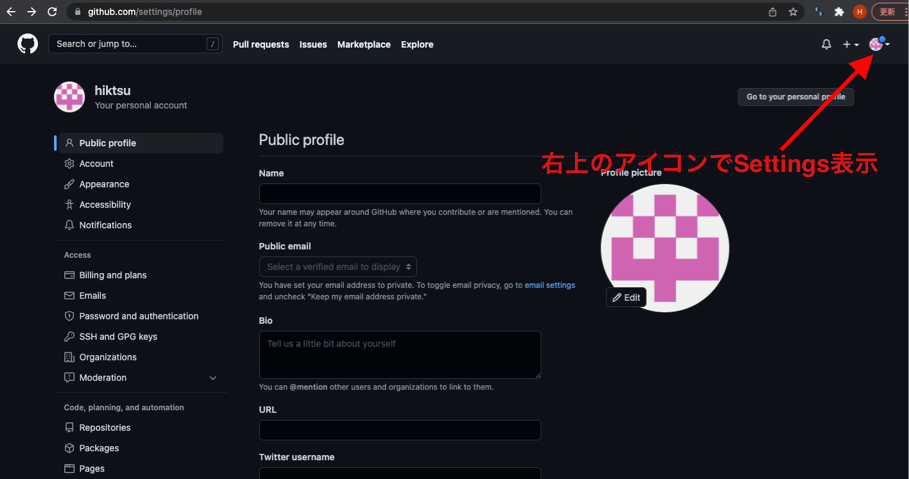
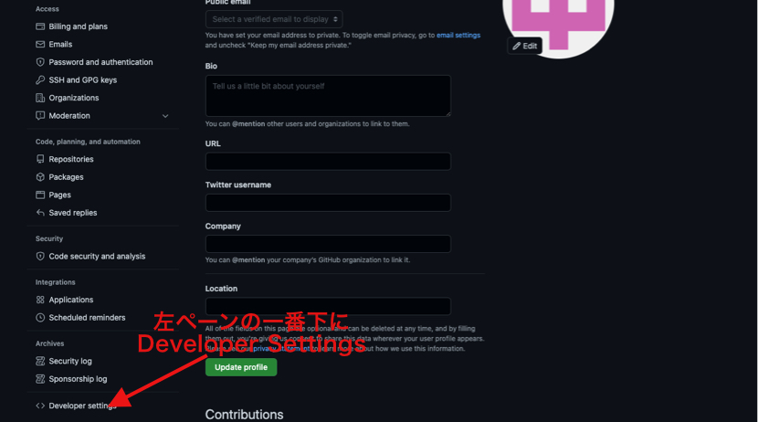
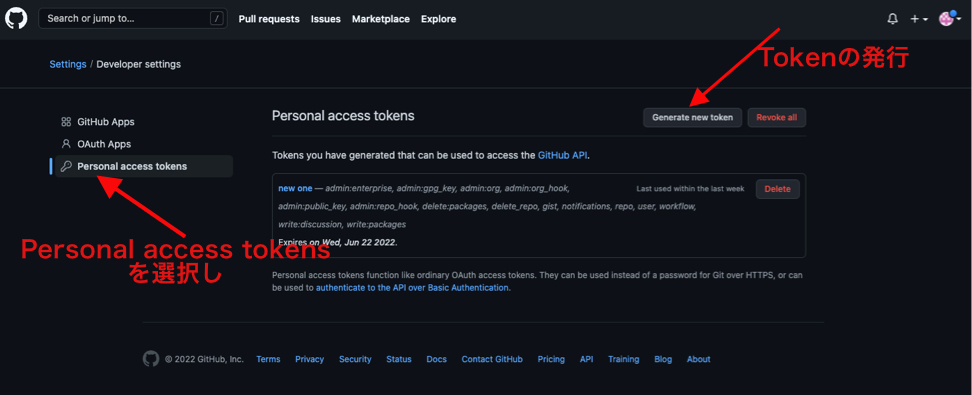
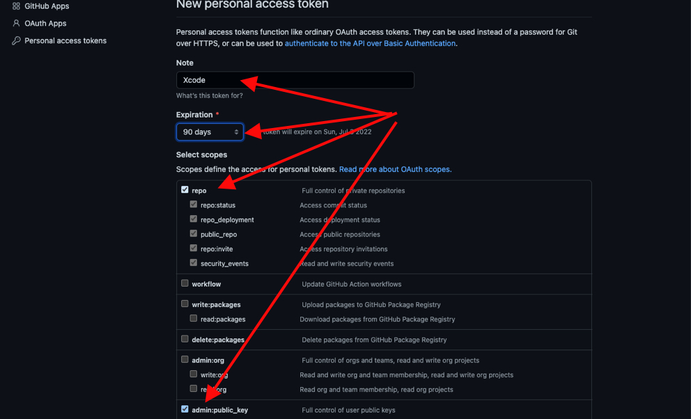
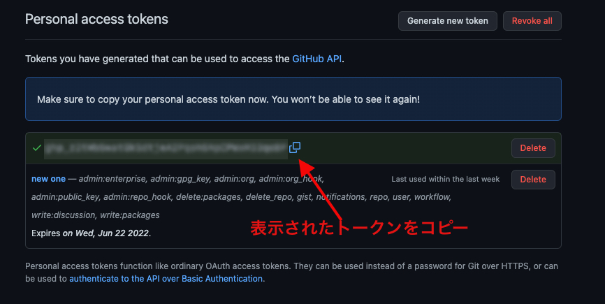
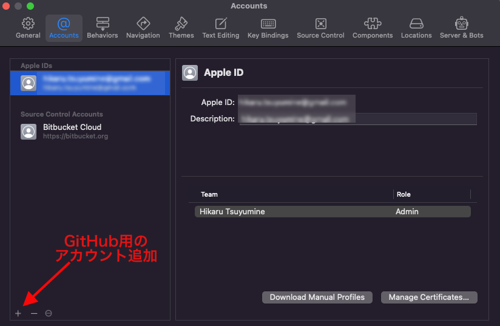
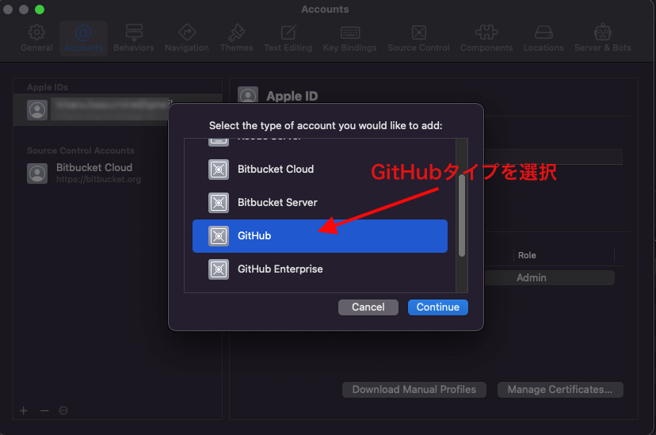
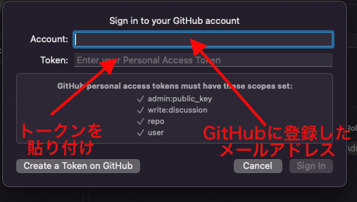

# XcodeからGit,GitHubを使う

## 事前の準備

 * GitHubにアカウントを作成する
 [GitHubの公式ページ](https://docs.github.com/ja/get-started/signing-up-for-github/signing-up-for-a-new-github-account)、その他参考ホームページを参照に、GitHubにアカウントを作成しておきます。
 * Xcodeももちろんインストールしておきます。また、このガイドではXcode 13.2.1を使用しています。

## XcodeおよびGitHub側の設定

1. GitHubでPersonal Account Tokenを発行する。 GitHubにログインし、下図を参照にSettings,Developer Settings さらにPersonal Access Tokensの画面を開く

&nbsp;

 
  
2. Noteに任意の名前(ここではXcode)、有効期間、およびScopeを設定する。Xcodeで必要なScopeはadmin:public_key,write:discussion,repo,userの４つすべてを選択する
  
  
  
  
 
                 
  
       
3. 発行されたトークンをコピーしておく

 
  
4. XcodeからGitHubにアクセスできるように、アカウント情報とトークンを設定する。Xcode -> Preferences -> Accountsを選択し、GitHubアカウントを追加し、GitHubに登録したメールアドレスを入力し、トークンを貼り付ける

&nbsp; 
 

 
 

